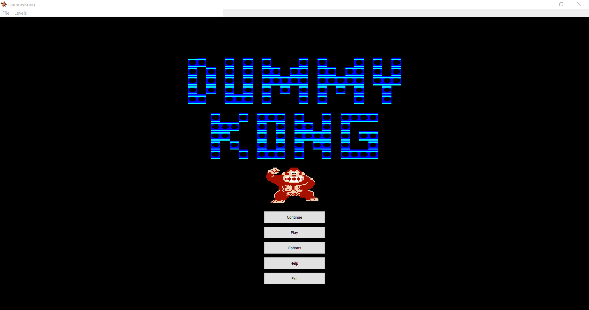
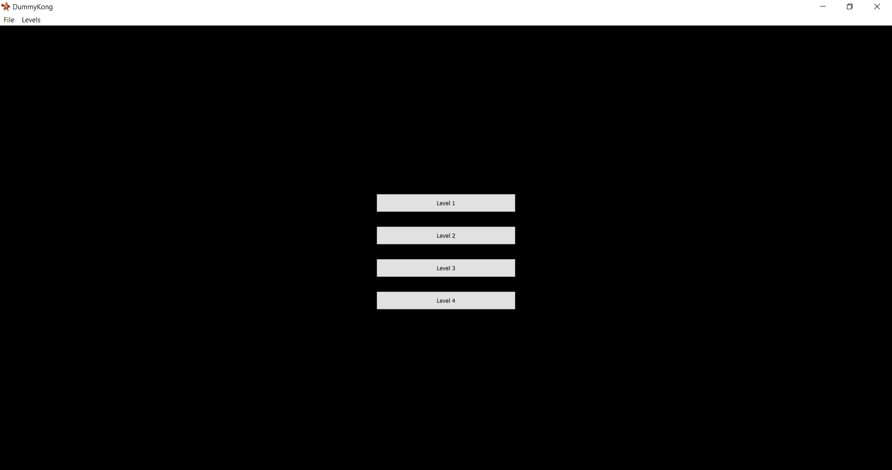
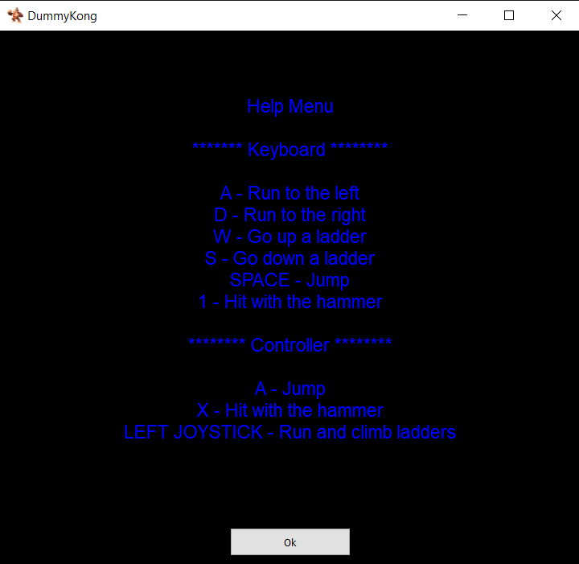
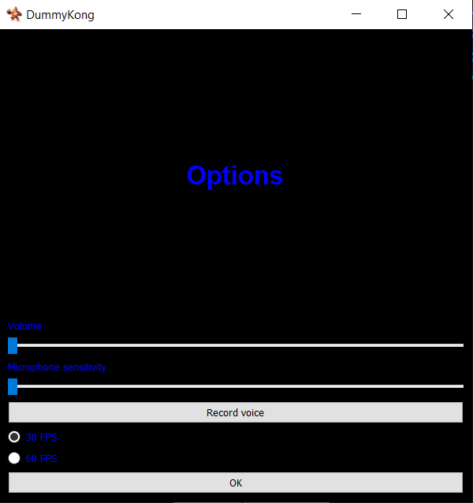
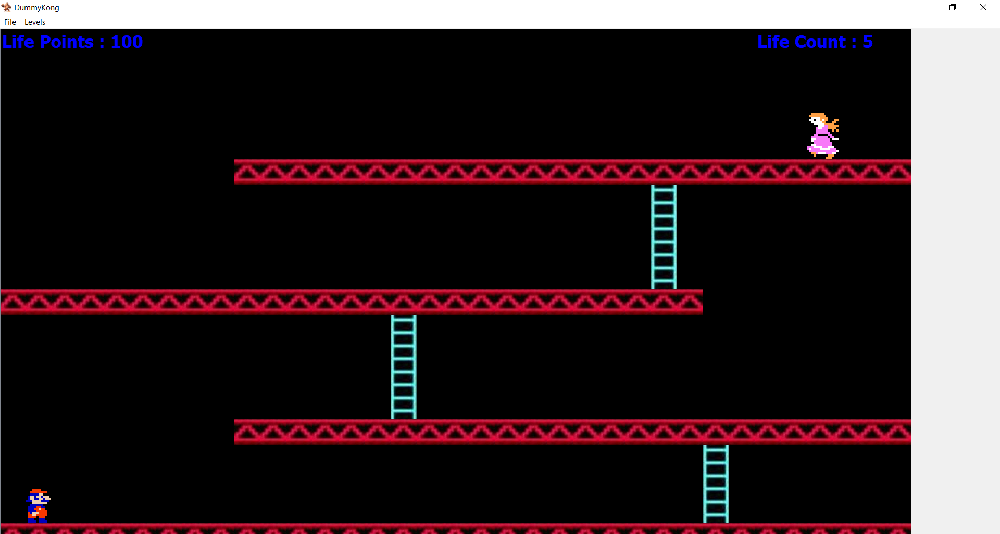

# DummyKongUI
UI du projet de session de l'équipe P2.
Le projet consiste à faire un donkey kong version arcade classique qui serait contrôlé par la voix. L'équipe informatique traite le signal de façon digital alors que l'équipe électronique traite le signal de façon analogique.
# Main Window

# Level Window

# Help Window

# Option Window

# Level 1

